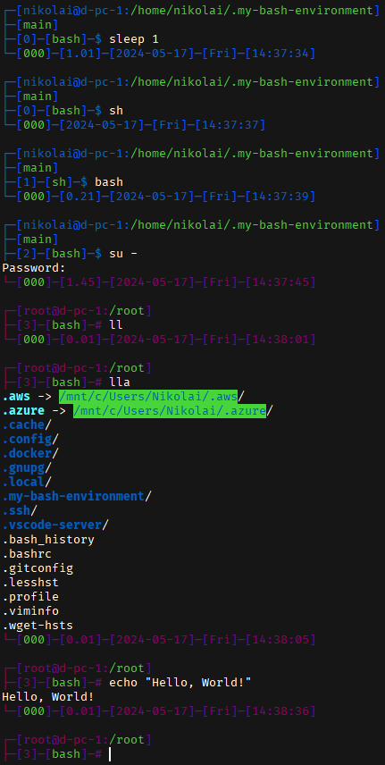

# .my-bash-environment

My CLI configs to easily download and use on new machines.

## 1. Preview



## 2. Installation

### 2.1. One command

- Debian-based:
   
   ```bash
   sudo apt-get update && sudo apt-get install -y curl git psmisc bat source-highlight && \
   if [ -d "${HOME}/.my-bash-environment" ]; then rm -rf "${HOME}/.my-bash-environment"; fi && \
   git clone https://github.com/Nikolai2038/.my-bash-environment.git "${HOME}/.my-bash-environment" && \
   rm -rf "${HOME}/.my-bash-environment/.git" && \
   source "${HOME}/.my-bash-environment/main.sh"
   ```

- Arch-based:

   ```bash
   sudo pacman -Sy --noconfirm --needed curl git psmisc bat source-highlight && \
   if [ -d "${HOME}/.my-bash-environment" ]; then rm -rf "${HOME}/.my-bash-environment"; fi && \
   git clone https://github.com/Nikolai2038/.my-bash-environment.git "${HOME}/.my-bash-environment" && \
   rm -rf "${HOME}/.my-bash-environment/.git" && \
   source "${HOME}/.my-bash-environment/main.sh"
   ```

### 2.2. Step by step

1. Make sure `curl` and `git` are installed:

   - Debian-based:

      ```bash
      sudo apt-get update && sudo apt-get install -y curl git
      ```

   - Arch-based:

      ```bash
      sudo pacman -Sy --noconfirm --needed curl git
      ```

2. (Optional) Install packages for extra functional:

   - Debian-based:
   
      ```bash
      sudo apt-get update && sudo apt-get install -y psmisc bat source-highlight
      ```

   - Arch-based:

      ```bash
      sudo pacman -Sy --noconfirm --needed psmisc bat source-highlight
      ```

   Descriptions:

    - `psmisc` for `pstree` command - to show terminal depth;
    - `bat` for `bat`/`batcat` command - colorized `cat`;
    - `source-highlight` for colorful `less` command.

3. Clone repository and apply script:

   ```bash
   if [ -d "${HOME}/.my-bash-environment" ]; then rm -rf "${HOME}/.my-bash-environment"; fi && \
   git clone https://github.com/Nikolai2038/.my-bash-environment.git "${HOME}/.my-bash-environment" && \
   rm -rf "${HOME}/.my-bash-environment/.git" && \
   source "${HOME}/.my-bash-environment/main.sh"
   ```

## 3. Update

Script will autoupdate itself. You can disable it via env-variables (see below).

You can also just run installation above to update by hand.

## 4. Aliases (in work)

### 4.1. Snapper

#### 4.1.1. Print a list of existing Snapper configs

```bash
n2038_snapper_list_configs
```

#### 4.1.2. Print a list of snapshots of specified Snapper config

```bash
n2038_snapper_list_snapshots
```

#### 4.1.3. Creates a snapshots with specified comment for specified Snapper config

```bash
n2038_snapper_create_snapshot <info (description)>
```

#### 4.1.4. Creates snapshots for all Snapper configs

```bash
n2038_snapper_create_snapshots_for_all_configs <info (description)>
```

#### 4.1.5. Creates snapshots for main Snapper configs (which for me are: `rootfs`, `home` and `root`)

```bash
n2038_snapper_create_snapshots_for_main_configs <info (description)>
```

## 4. Settings

You can change script's behaviour via env-variables:

- `N2038_DISABLE_BASH_ENVIRONMENT_AUTOUPDATE` - if equals to `1`, will disable autoupdate (default: `0`);
- `N2038_DISABLE_BASH_ENVIRONMENT_CLEAR` - if equals to `1`, will disable `clear` after shell creates (default: `1`);
- `N2038_DISABLE_BASH_ENVIRONMENT_MESSAGES` - if equals to `1`, will disable some messages on new shell created (default: `1`).

You should set their values in your `.bashrc` file. Example:

```bash
N2038_DISABLE_BASH_ENVIRONMENT_AUTOUPDATE=1
source "${HOME}/.my-bash-environment/main.sh"
```

## 5. Contribution

At the moment, I use these configurations for myself, but they can be generalized.

Feel free to contribute via [pull requests](https://github.com/Nikolai2038/wayland-clipboard-fix/pulls) or [issues](https://github.com/Nikolai2038/wayland-clipboard-fix/issues)!
